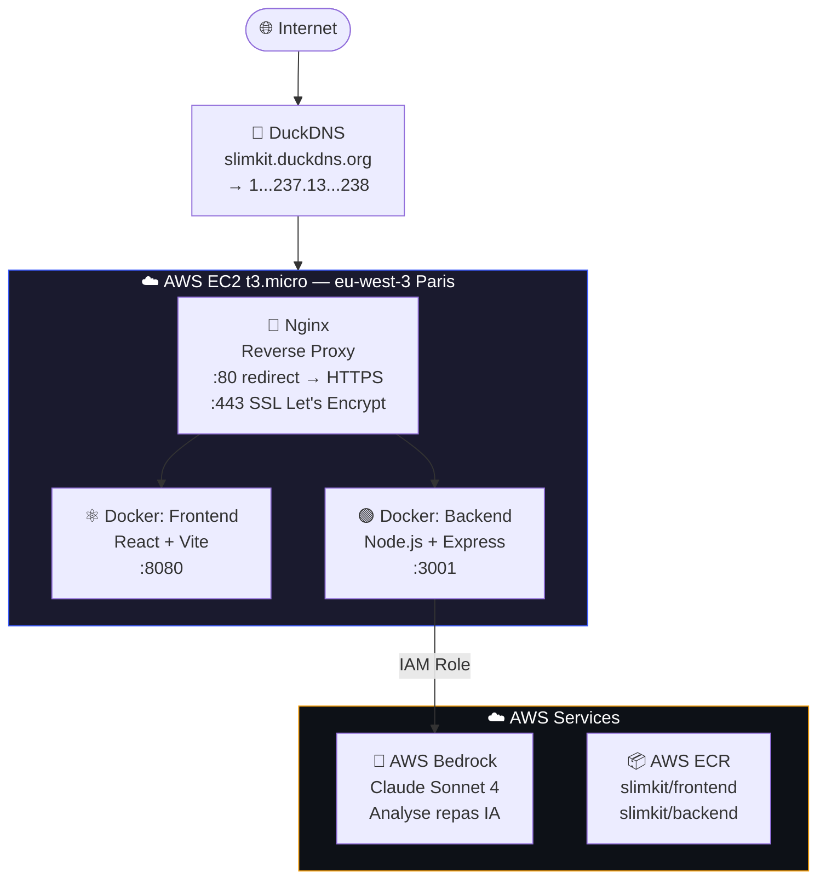
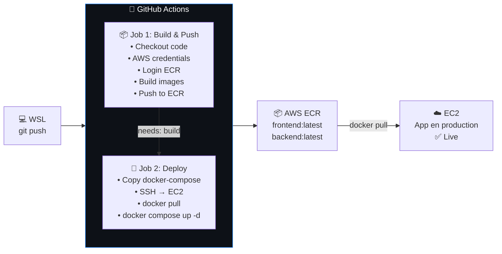
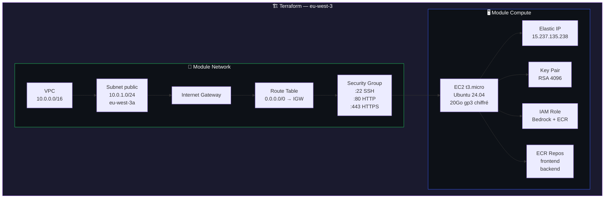

# 🏃 SlimKit 


> **🔒 Live** : [https://slimkit.duckdns.org](https://slimkit.duckdns.org)

---

## 🤝 Honnêteté intellectuelle

Ce projet a été réalisé dans un **contexte d'apprentissage personnel**.

L'intégralité du **code applicatif** (frontend React, backend Node.js, logique métier) a été **générée par Claude (Anthropic)**.

En revanche, **Frédéric Junior EPESSE PRISO** a :
- Suivi et compris chaque étape du déploiement
- Provisionné l'infrastructure AWS **manuellement via AWS CLI et Terraform**
- Configuré le pipeline **CI/CD GitHub Actions** de A à Z
- Déployé l'application en **environnement de production réel**
- Configuré **HTTPS avec Let's Encrypt + DuckDNS**
- Résolu les problèmes rencontrés (Security Groups, IAM roles, DNS propagation...)
- Appris et appliqué des **compétences DevOps concrètes**

Ce projet est un **projet personnel d'apprentissage**, pas un projet professionnel.

---

## 📋 Description

SlimKit est une application web mobile-first qui aide à perdre du poids par la marche. Elle calcule un objectif quotidien de pas personnalisé selon l'âge, le poids et l'objectif de l'utilisateur, et propose une analyse nutritionnelle des repas par photo grâce à l'IA.

### Fonctionnalités
- **Onboarding en 3 étapes** : Profil → Groupe d'âge → Objectif
- **Calcul personnalisé** : Pas/jour, km, calories brûlées selon l'âge et l'objectif
- **Conseils adaptés** par tranche d'âge (20-29, 30-39, 40-49, 50-59, 60+)
- **Analyse IA des repas** : photo → calories, protéines, glucides, lipides, score santé
- **Propulsé par Claude Sonnet 4** via AWS Bedrock

---

## 🏗️ Architecture

### Infrastructure globale



### Pipeline CI/CD



### Infrastructure Terraform



---

## 🛠️ Stack technique

| Composant | Technologie |
|-----------|-------------|
| Frontend | React 18 + Vite |
| Backend | Node.js + Express |
| IA | AWS Bedrock (Claude Sonnet 4) |
| Conteneurs | Docker + Docker Compose |
| Registry | AWS ECR |
| Serveur | AWS EC2 t3.micro (Ubuntu 24.04) |
| IaC | Terraform 1.9.x |
| CI/CD | GitHub Actions |
| Reverse Proxy | Nginx |
| SSL | Let's Encrypt (Certbot) |
| DNS | DuckDNS |
| Région AWS | eu-west-3 (Paris) |

---

## 📚 Ce que j'ai appris en déployant ce projet

### 1. AWS & Cloud
- Création et gestion d'un compte AWS
- Configuration d'utilisateurs **IAM** avec le principe du moindre privilège
- Utilisation d'**AWS CLI** pour piloter l'infrastructure sans interface graphique
- Compréhension du réseau AWS : **VPC, Subnet, Internet Gateway, Route Table, Security Groups**
- Déploiement d'une instance **EC2** et connexion SSH
- Utilisation d'**AWS ECR** comme registry Docker privé
- Intégration d'**AWS Bedrock** pour utiliser des modèles IA en production
- Attachement de **IAM Roles** à une instance EC2 pour l'authentification sans clé

### 2. Terraform (Infrastructure as Code)
- Écriture de fichiers `.tf` avec une architecture **modulaire** (modules network/compute)
- Utilisation des **variables, outputs et tfvars**
- Commandes essentielles : `terraform init`, `plan`, `apply`
- Gestion du **state Terraform**
- Comprendre pourquoi l'IaC est préférable à la configuration manuelle

### 3. Docker & Conteneurs
- Écriture de **Dockerfiles** multi-stage (build + production)
- Utilisation de **Docker Compose** pour orchestrer plusieurs services
- Distinction entre image de développement et de production
- Build, tag et push d'images vers un **registry privé**
- Gestion des variables d'environnement dans les containers

### 4. CI/CD avec GitHub Actions
- Écriture d'un **workflow YAML** complet
- Gestion des **secrets GitHub** (AWS keys, SSH key, ECR registry...)
- Pipeline en 2 jobs : **Build & Push** → **Deploy**
- Utilisation d'**actions communautaires** (aws-actions, appleboy/ssh-action, scp-action)
- Déclenchement automatique sur `git push`
- Débogage de pipelines en échec via les logs

### 5. Linux & Administration système
- Navigation et gestion de fichiers sous **Ubuntu**
- Installation de paquets avec `apt`
- Gestion des services avec **systemd** (`systemctl start/enable/status`)
- Configuration de **Nginx** comme reverse proxy
- Gestion des permissions fichiers (`chmod 600`)

### 6. SSL/HTTPS & DNS
- Compréhension du fonctionnement des **certificats SSL/TLS**
- Utilisation de **Let's Encrypt** (autorité de certification gratuite)
- Utilisation de **Certbot** pour obtenir et configurer un certificat
- Validation par **challenge DNS TXT**
- Configuration d'un sous-domaine gratuit avec **DuckDNS**
- Propagation DNS et vérification avec `dig`

### 7. DevOps & Bonnes pratiques
- Séparation des environnements (dev/prod)
- Sécurisation des secrets (jamais dans le code)
- Architecture **frontend/backend** conteneurisée
- Principe du **reverse proxy** pour exposer les services
- Compréhension du flux complet : code → build → registry → déploiement

---

## 🗂️ Structure du projet

```
slimkit-app/
├── .github/
│   └── workflows/
│       └── deploy.yml          # Pipeline CI/CD GitHub Actions
├── frontend/
│   ├── src/
│   │   ├── App.jsx             # Application React complète
│   │   └── main.jsx            # Point d'entrée React
│   ├── index.html
│   ├── vite.config.js
│   ├── nginx.conf              # Config Nginx dans le container
│   ├── package.json
│   └── Dockerfile              # Multi-stage: build + nginx
├── backend/
│   ├── server.js               # API Express + AWS Bedrock
│   ├── package.json
│   └── Dockerfile
├── docker-compose.yml          # Développement local
├── docker-compose.prod.yml     # Production (images ECR)
├── .gitignore
└── README.md
```

```
slimkit-infra/                  # Infrastructure Terraform
├── main.tf
├── variables.tf
├── outputs.tf
├── terraform.tfvars            # ⚠️ jamais sur Git
└── modules/
    ├── network/
    │   ├── main.tf             # VPC, Subnet, IGW, Routes, SG
    │   ├── variables.tf
    │   └── outputs.tf
    └── compute/
        ├── main.tf             # EC2, Key Pair, EIP, ECR
        ├── variables.tf
        ├── outputs.tf
        └── userdata.sh         # Script d'init EC2
```

---

## 🚀 Déploiement

Chaque `git push` sur la branche `main` déclenche automatiquement le pipeline :

```bash
git add .
git commit -m "feat: ma nouvelle fonctionnalité"
git push origin main
# → GitHub Actions build, push et déploie automatiquement
```

Surveiller le déploiement :
```bash
gh run watch --repo Whitedukecmr/slimkit-app
```

---

## 🔄 Renouvellement SSL

Le certificat Let's Encrypt expire le **02/09/2026**. Pour le renouveler :

```bash
sudo certbot certonly \
  --manual \
  --preferred-challenges dns \
  -d slimkit.duckdns.org \
  --email chocobig505@gmail.com \
  --agree-tos
# Puis mettre à jour DuckDNS avec la nouvelle valeur TXT
sudo systemctl reload nginx
```

---

## 👤 Auteur

**Frédéric Junior EPESSE PRISO**
Alternant en systèmes, réseaux et cloud computing

- Déploiement, infrastructure et configuration : Frédéric Junior EPESSE PRISO
- Code applicatif : généré par [Claude](https://claude.ai) (Anthropic)
- Projet personnel d'apprentissage DevOps — Juin 2026
